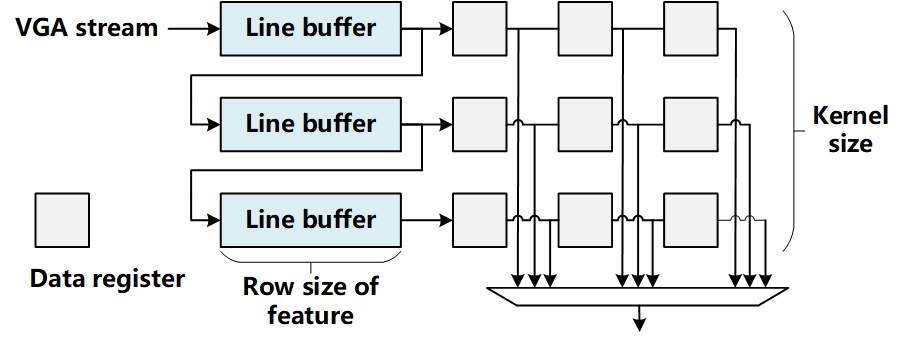
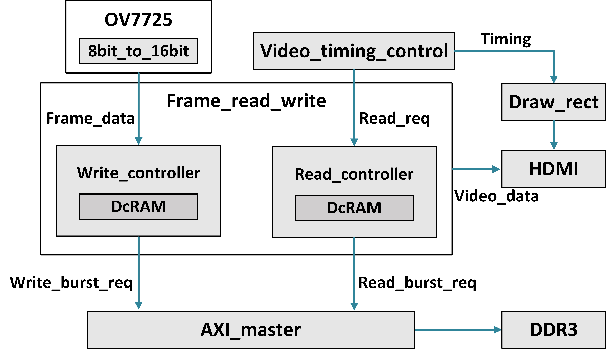
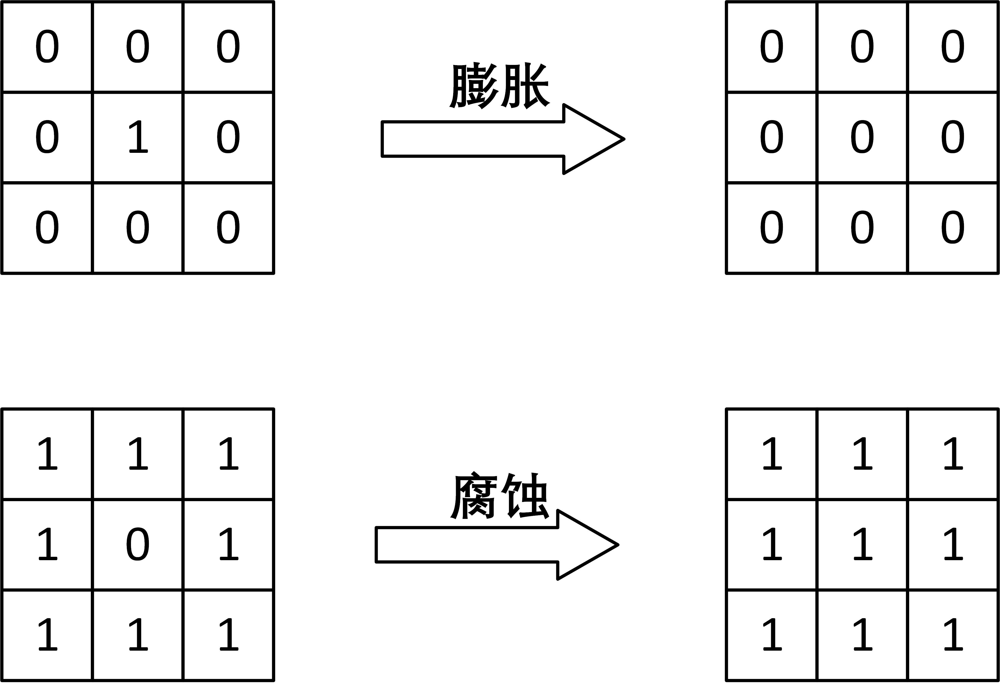
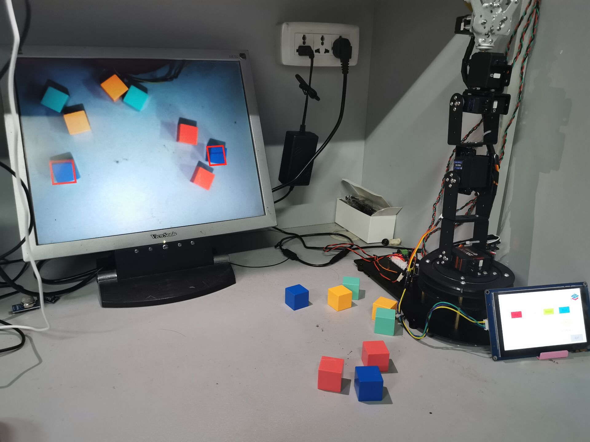

# Multiple Color recognition

An accelerator for multiple objects recognition is presented.
Line buffer, morphological processing is implemented for Multi­Connected Domain Detection.

## Introduction

The multi quantity, color, and shape methods enable target recognition to be applied in multiple scenarios, not only for different colored drug packaging, but also for recognizing fruits and garbage classification, achieving the reconfigurability of robots.

## Architecture

### Streaming Flow

### Frame Transfer

## Modules

Multi object recognition is determined through a two-stage pipeline: at the beginning of a frame, a certain number of connected domain objects are pre-set, with members having flag bits and four sided area ranges. When VGA streaming data arrives, the new coordinates are sequentially judged in the first cycle of the pipeline to determine whether they are within the pre-set target area. If not, the new area is marked. In the second cycle, the judgment area of the target connected domain from the previous cycle is updated.

Shape recognition is achieved by scanning the slope changes of horizontal and vertical counters to determine the edges and corners of connected domains.

### Color Space Transformation

### Binarization

### Morphological Processing

Our goal is to use corrosion and dilation to remove noise points from the output binary matrix (which is a binary sequence in memory) and prevent noise points from interfering with the judgment. The specific choice is to use a 3 × 3 matrix to complete corrosion and expansion.

### Multiple Object Recognition

## Implementation

